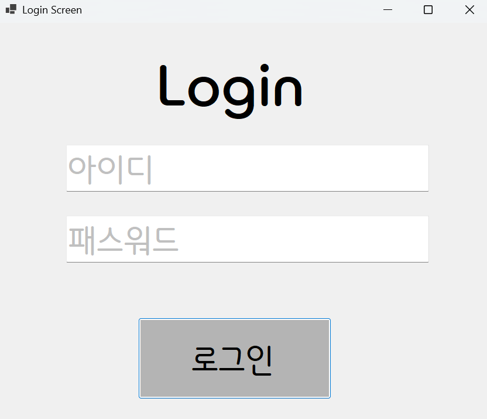
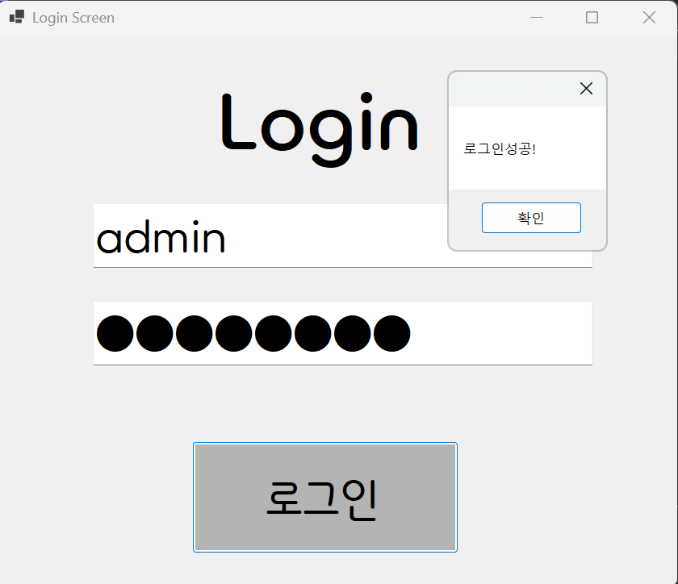
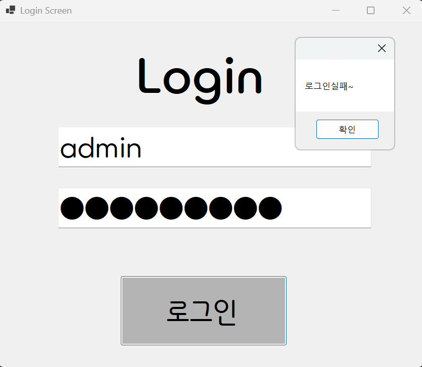
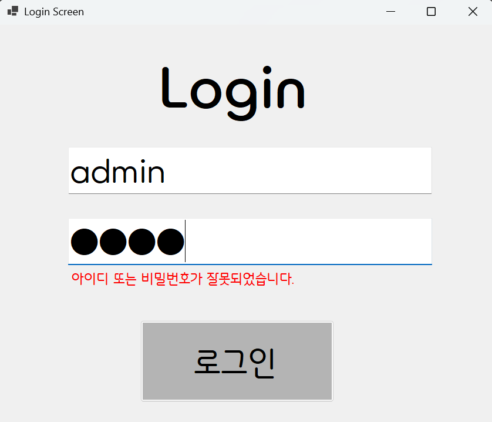

# (C# 코딩) Login Screen

## 개요
- C# 프로그래밍학습
- 1줄소개: 사용자의 아이디와 패스워드를입력받는 로그인 화면
- 사용한플랫폼: 
  - C#, .NET Windows Forms, Visual Studio, GitHub
- 사용한컨트롤:
  - Label, TextBox, Button
- 사용한기술과구현한기능:
 - Visual Studio를 이용하여 UI 디자인
 - 패스워드 입력 내용을 숨기는 기능 구현
 - Placeholder 기능 구현
 - 탭을 이용한 입력 포커스 제어

## 실행화면(과제1)
- 과제1 코드의 실행 스크린샷

- 과제내용
 - Label(표시), TextBox(입력), Button(전송)을 적절히 배치합니다.
 - TextBox에 Placeholder 기능을 구현하여 안내 문구를 배치합니다.
 - 아이디와 패스워드를 입력 받아 확인합니다.

- 구현내용과기능설명
 - 처음 실행시 입력 포커스가 버튼으로 가도록 조정합니다.
 - 아이디와 패스워드를 입력 받는 창에는 안내 문구가 표시되도록 구현합니다.
 - 아이디와 패스워드가 올바르지 않을 때와 올바를 때 로그인의 성공과 실패 여부가 표시되도록 팝업 창을 띄웁니다.

 - 로그인이 성공하였을 때
	
 - 로그인이 실패하였을 때
	
## 실행화면(과제2)
- 과제2코드의실행스크린샷

- 과제내용
 - Label 컨트롤을 추가합니다.
 - Visible 속성을 이용해서 메시지 보이기와 숨기기 기능을 구현합니다.

- 구현내용과기능설명
 - 사용자 편의를 위해 팝업창으로 로그인 실패를 알리기보단 팝업창을 띄우지 않고 텍스트박스 밑에 빨간글씨로 알림이 나오도록 수정했습니다.

## 실행화면(과제3)
- 과제3코드의실행스크린샷

- 과제내용
 - ㅁㄴㅇㄹ
 - ㅁㄴㅇㄹ
 - ㅁㄴㅇㄹ

- 구현내용과기능설명
 - ㅁㄴㅇㄹ
 - ㅁㄴㅇㄹ
 - ㅁㄴㅇㄹ

## 실행화면(과제4)
- 과제4코드의실행스크린샷

- 과제내용
 - ㅁㄴㅇㄹ
 - ㅁㄴㅇㄹ
 - ㅁㄴㅇㄹ

- 구현내용과기능설명
 - ㅁㄴㅇㄹ
 - ㅁㄴㅇㄹ
 - ㅁㄴㅇㄹ